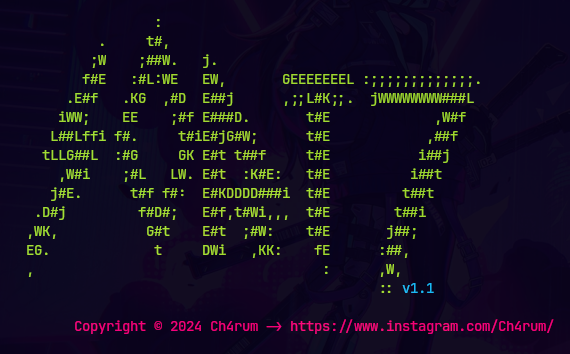

# Sorting - Analysis of Sorting Algorithms

    
  <a href="#-description"><kbd> Description </kbd></a> &ensp;
  <a href="#-features"><kbd> Feature </kbd></a> &ensp;
  <a href="#-contributions"><kbd> Contributions </kbd></a>

This project provides an implementation of multiple sorting algorithms, such as *Bubble*, *Selection*, *Insertion*, *Mergesort* and *Quicksort* algorithms, written in Python and Go. The script allow you to load numeric data from files, execute sorting using the selected algorithm, and visualize execution statistics such as time elapsed. 

## ✨ Description

Each implementation ([Go](./Go/README.md) and [Python](./Python/README.md)) provides a command-line interface to run sorting operations over data files.

The algorithms implemented are:
- **Bubble Sort:** Compares and sorts adjacent items in the list.
- **Selection Sort:** Finds the smallest element and places it in the correct position.
- **Insertion Sort:** Inserts the unsorted items in the correct position.
- **Merge Sort:** Divide and conquer to sort.
- **Quick Sort:** Uses the pivot to split the list and sort the subsets.

Performace statistics are printed after execurion for comparison.

## 🎉 Features
You can choose your preferred languaje and chek its specific instructions:

> - [Python README](./Python/README.md)
> - [Go README](./Go/README.md)

## 📧 Contributions

Feel free to fork this repository and propose improvements or additional features though pull requests. 

